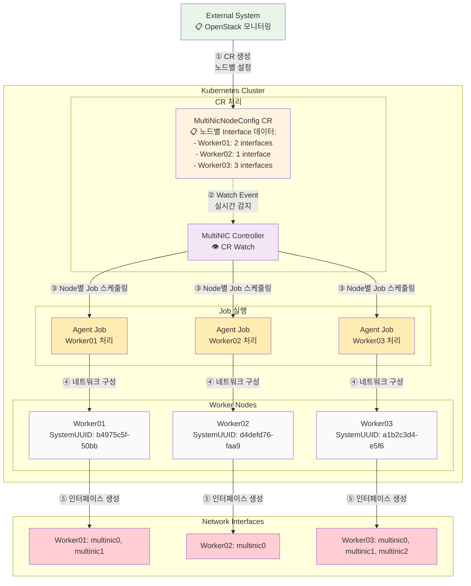
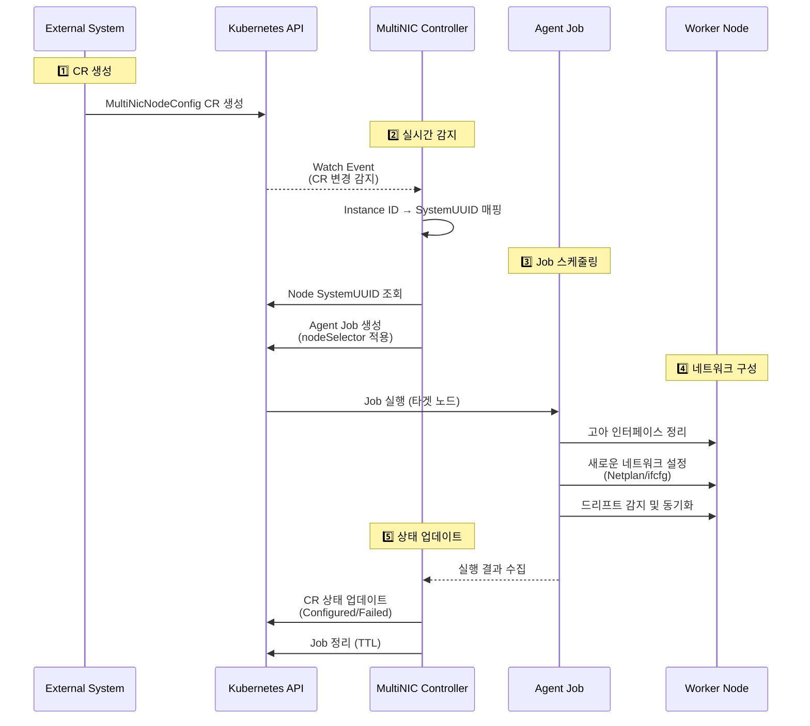

# MultiNIC Agent

> **Kubernetes 네이티브 네트워크 자동화 에이전트**

OpenStack 환경에서 Kubernetes 노드의 다중 네트워크 인터페이스를 **완전 자동으로 관리**하는 Controller + Job 기반 시스템입니다.

## 🔄 현재 로직 흐름

### 시스템 아키텍처



### 처리 워크플로우



## 📦 패키지 구조

```
multinic-agent/
├── cmd/
│   ├── agent/                 # Agent Job 바이너리
│   └── controller/            # Controller 바이너리
├── internal/                  # Clean Architecture
│   ├── domain/               # 도메인 계층
│   │   ├── entities/         # NetworkInterface, InterfaceName
│   │   ├── interfaces/       # Repository, Network 인터페이스
│   │   └── services/         # InterfaceNamingService
│   ├── application/          # 애플리케이션 계층
│   │   └── usecases/        # ConfigureNetwork, DeleteNetwork
│   ├── infrastructure/       # 인프라스트럭처 계층
│   │   ├── persistence/     # MySQL Repository
│   │   ├── network/         # Netplan, RHEL Adapter
│   │   └── config/         # 설정 관리
│   └── controller/          # Controller 구현
│       ├── reconciler.go   # CR 처리 로직
│       ├── watcher.go      # Watch 이벤트 처리
│       └── service.go      # Controller 서비스
├── deployments/
│   ├── crds/               # CRD 정의 및 샘플
│   └── helm/              # Helm 차트
└── scripts/               # 배포 자동화
```

## 🔧 CRD 설계

### MultiNicNodeConfig CRD 스키마

```yaml
apiVersion: apiextensions.k8s.io/v1
kind: CustomResourceDefinition
metadata:
  name: multinicnodeconfigs.multinic.io
spec:
  group: multinic.io
  versions:
  - name: v1alpha1
    served: true
    storage: true
    schema:
      openAPIV3Schema:
        type: object
        properties:
          spec:
            type: object
            properties:
              nodeName:
                type: string
                description: "Target Kubernetes node name"
              instanceId:
                type: string
                description: "OpenStack Instance UUID"
              interfaces:
                type: array
                items:
                  type: object
                  properties:
                    id:
                      type: integer
                    macAddress:
                      type: string
                    address:
                      type: string
                    cidr:
                      type: string
                    mtu:
                      type: integer
          status:
            type: object
            properties:
              state:
                type: string
                enum: ["Pending", "Processing", "Configured", "Failed"]
              lastProcessed:
                type: string
              interfaceStatuses:
                type: object
```

### 예시 CR 적용

```yaml
apiVersion: multinic.io/v1alpha1
kind: MultiNicNodeConfig
metadata:
  name: viola2-biz-worker01
  namespace: multinic-system
  labels:
    multinic.io/node-name: viola2-biz-worker01
    multinic.io/instance-id: b4975c5f-50bb-479f-9e7b-a430815ae852
spec:
  nodeName: viola2-biz-worker01
  instanceId: b4975c5f-50bb-479f-9e7b-a430815ae852
  interfaces:
    - id: 1
      macAddress: fa:16:3e:1c:1a:6e
      address: 11.11.11.37
      cidr: 11.11.11.0/24
      mtu: 1450
    - id: 2
      macAddress: fa:16:3e:0a:17:3b
      address: 11.11.11.148
      cidr: 11.11.11.0/24
      mtu: 1450
```

## 🚀 배포 방법

### 1. SSH 패스워드 설정
```bash
# deploy.sh 스크립트에서 SSH_PASSWORD 수정
vi scripts/deploy.sh
# SSH_PASSWORD=${SSH_PASSWORD:-"YOUR_SSH_PASSWORD"} → 실제 패스워드로 변경
```

## 🚀 빠른 시작

### 사전 요구사항
- Kubernetes 1.24+
- Helm 3.0+
- kubectl
- nerdctl (컨테이너 런타임)

### 설치

#### 1단계: 컨테이너 이미지 배포
```bash
# 사전 빌드된 이미지 사용 (권장)
# deployments/images/ 디렉토리에 있는 tar 파일을 모든 노드에 배포

# 방법 1: 스크립트로 모든 노드에 배포 (권장)
NODES=(192.168.1.10 192.168.1.11 192.168.1.12)  # 실제 노드 IP로 변경
for node in "${NODES[@]}"; do
    echo "Deploying to $node..."
    scp deployments/images/multinic-agent-1.0.0.tar root@$node:/tmp/
    ssh root@$node "nerdctl load -i /tmp/multinic-agent-1.0.0.tar && rm /tmp/multinic-agent-1.0.0.tar"
done

# 방법 2: 개별 노드에 수동 배포
scp deployments/images/multinic-agent-1.0.0.tar root@192.168.1.10:/tmp/
ssh root@192.168.1.10 "nerdctl load -i /tmp/multinic-agent-1.0.0.tar"

# 방법 3: 직접 빌드 (개발용)
nerdctl build -t multinic-agent:1.0.0 .
```

#### 2단계: 네임스페이스 생성
```bash
kubectl create namespace multinic-system
```

#### 3단계: CRD 설치
```bash
# MultiNicNodeConfig CRD 설치
kubectl apply -f deployments/crds/multinicnodeconfig-crd.yaml

# CRD 설치 확인
kubectl get crd multinicnodeconfigs.multinic.io
```

#### 4단계: MultiNic Agent 설치
```bash
helm install multinic-agent ./deployments/helm \
  --namespace multinic-system \
  --set image.tag=1.0.0 \
  --set controller.replicas=1 \
  --wait --timeout=300s
```

### 업그레이드
```bash
# 차트 업그레이드
helm upgrade multinic-agent ./deployments/helm \
  --namespace multinic-system \
  --set image.tag=1.0.1 \
  --wait --timeout=300s
```

### 제거
```bash
# 차트 제거
helm uninstall multinic-agent -n multinic-system

# CRD 제거 (선택사항)
kubectl delete crd multinicnodeconfigs.multinic.io

# 네임스페이스 제거 (선택사항)
kubectl delete namespace multinic-system
```

## 🚀 원클릭 배포 (자동화)

이 Helm 차트는 MultiNic Agent의 모든 컴포넌트를 Kubernetes 클러스터에 배포하고 관리합니다.

```bash
vi ./scripts/deploy.sh

SSH_PASSWORD=${SSH_PASSWORD:-"배포 대상 ssh password 입력"}

저장 후 deploy.sh 실행
```

```bash
# 자동 배포 실행
./scripts/deploy.sh
```

**배포 스크립트 기능:**
- ✅ 필수 도구 확인 (`nerdctl`, `helm`, `kubectl`, `sshpass`)
- 🔨 이미지 빌드 (`nerdctl build`)
- 📦 모든 노드에 이미지 배포 (`scp` + `nerdctl load`)
- 🎯 CRD 설치 (`kubectl apply`)
- ⚙️ Helm 차트 배포 (`helm upgrade --install`)
- ✅ 배포 상태 확인

## ✅ 배포 완료 확인

### 1. Controller 상태 확인
```bash
# Controller Pod 실행 확인
kubectl get pods -n multinic-system -l app.kubernetes.io/name=multinic-agent-controller

# Controller 로그 확인
kubectl logs -n multinic-system -l app.kubernetes.io/name=multinic-agent-controller
```

### 2. 샘플 CR 테스트
```bash
# 샘플 CR 적용
kubectl apply -n multinic-system -f deployments/crds/samples/

# CR 상태 확인
kubectl get multinicnodeconfigs -n multinic-system

# 생성된 Job 확인
kubectl get jobs -n multinic-system -l app.kubernetes.io/name=multinic-agent
```

### 3. 성공 확인 방법
```bash
# CR 상태가 "Configured"인지 확인
kubectl get multinicnodeconfigs -n multinic-system -o custom-columns=NAME:.metadata.name,STATE:.status.state
```

**예상 성공 결과**
```
root@bastion:~/multinic-agent# kubectl get multinicnodeconfigs -n multinic-system -o custom-columns=NAME:.metadata.name,STATE:.status.state
NAME                  STATE
viola2-biz-master03   Configured
```
