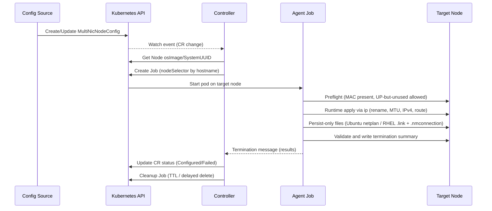

# MultiNIC Agent

> **Kubernetes 네이티브 네트워크 자동화 에이전트**

OpenStack 환경에서 Kubernetes 노드의 다중 네트워크 인터페이스를 **완전 자동으로 관리**하는 Controller + Job 기반 시스템입니다.

## 개요

### 핵심 특징
- **단일 이미지, 이중 실행**: 하나의 컨테이너 이미지에서 Controller/Agent 모드로 동작
- **자동화 워크플로우**: CR 생성/수정 시 즉시 해당 노드에 Agent Job 스케줄링
- **노드별 맞춤 실행**: 각 노드의 SystemUUID 검증 후 네트워크 인터페이스 자동 설정
- **실시간 상태 동기화**: Job 완료 후 Controller가 자동으로 CR status 업데이트
- **라우팅 충돌 방지**: 전역 라우팅 직렬화로 네트워크 테이블 안정성 보장
- **성능 최적화**: 안정성 우선 동시성 제어 (기본 1개 작업, 설정 가능)
  

### 동작 방식
1. **Controller (Deployment)**: CR 변경사항을 실시간 감시
2. **Agent (Job)**: 특정 노드에서만 실행되어 네트워크 인터페이스 설정
3. **자동 스케줄링**: CR 업데이트 → 해당 노드용 Agent Job 생성 → 네트워크 구성 → 상태 업데이트

### 결정 사항(운영 철학)
- 런타임 적용은 `ip` 기반으로 즉시 반영(이름/MTU/IPv4/라우트)
- 영속성은 OS별 파일 “작성만” 수행(즉시 `netplan apply`/`nmcli reload` 호출 없음)
- Ubuntu: netplan YAML에 `match.macaddress + set-name` 포함으로 이름 영속
- RHEL: `.link`(systemd-udev, 이름 영속) + `.nmconnection`(NetworkManager, 권한 600) 작성, Helm이 `/etc/systemd/network`도 마운트
- Preflight: UP NIC이라도 IPv4/라우트/마스터 소속이 없으면 허용; 우회 플래그 `PREFLIGHT_ALLOW_UP` 제공
- 라우팅/기본경로 변경은 전역 직렬화

## 현재 로직 흐름

### 시스템 아키텍처

```mermaid
graph TB
    External[Config Source / Operator]

subgraph "Kubernetes Cluster"
  subgraph "Control Plane"
    Controller[MultiNIC Controller (CR Watch)]
    CR[MultiNicNodeConfig CR]
  end
  subgraph "Nodes"
    AgentJob[Agent Job (node-selected)]
  end
end

subgraph "Node Runtime (per target node)"
  Preflight[Preflight checks\n- MAC present\n- UP-but-unused allowed]
  RuntimeIP[ip runtime apply\n- link rename\n- MTU\n- IPv4\n- route]
  Persist[Persist-only files\n- Ubuntu: /etc/netplan/90-*.yaml (match.macaddress + set-name)\n- RHEL: /etc/systemd/network/90-*.link + /etc/NetworkManager/system-connections/90-*.nmconnection\n- no immediate reload]
  Validate[Validation + summary]
end

External --> CR
CR -.Watch.-> Controller
Controller -->|schedule job| AgentJob
AgentJob --> Preflight --> RuntimeIP --> Persist --> Validate
Validate -->|termination summary| Controller
Controller -->|status update| CR
```

### 처리 워크플로우



## Agent Job 동작 및 안정성

### 네트워크 구성 프로세스
- **시작 시 정리 수행**(RUN_MODE=job):
  - Ubuntu: `/etc/netplan/9*-multinic*.yaml` 고아 파일만 삭제(즉시 `netplan apply`는 호출하지 않음)
  - RHEL: RHEL9+에서는 `/etc/sysconfig/network-scripts`가 없을 수 있으므로 `.nmconnection` 고아 파일만 정리하고 디렉터리 부재는 무시
  - 시스템 기본 파일(`50-cloud-init.yaml` 등)은 건드리지 않음
  - 남아있는 `multinic0~9` 인터페이스는 DOWN 상태일 때만 altname(ens*/enp*)으로 rename 시도(없으면 스킵)

- **이름 충돌 방지**(사전 배정): 실행 시작 시 MAC→`multinicX` 이름을 미리 배정해 중복 이름 충돌을 제거

- **검증 방식 전환**(이름→MAC):
  - 적용 후 검증은 `ip -o link show` 전체에서 CR의 MAC 존재 여부로 판단(특정 이름에 의존하지 않음)

- **처리 순서**: "정리 → 설정(적용) → 검증"으로 실행

### 안정성 기능
- **라우팅 충돌 방지**:
  - 전역 mutex를 통한 라우팅 테이블 직렬화
  - 동시 네트워크 설정으로 인한 라우팅 테이블 경쟁 상태 방지
  - 라우팅 작업 메트릭 수집 (실행 시간, 성공/실패율)

- **동시성 제어 최적화**:
  - 기본 최대 동시 작업 수: 1개 (안정성 우선)
  - Helm values를 통한 설정 가능 (`maxConcurrentTasks`)
  - 대규모 환경에서 라우팅 충돌 최소화
  

### 권장 배포 설정 (안정성 우선)
```bash
# 기본 설정 (안정성 최우선)
helm upgrade --install multinic-agent ./deployments/helm \
  -n multinic-system \
  --set image.tag=1.0.0 \
  --set maxConcurrentTasks=1

# 대규모 환경 (성능 우선시)
helm upgrade --install multinic-agent ./deployments/helm \
  -n multinic-system \
  --set image.tag=1.0.0 \
  --set maxConcurrentTasks=3

```

수동 전체 정리(옵션):
```bash
# 컨트롤러가 생성하는 Job에 환경변수로 전달되면 모든 multinic 파일만 정리
AGENT_ACTION=cleanup
```

## 패키지 구조

```
multinic-agent/
├── cmd/
│   ├── agent/                 # Agent Job 바이너리
│   └── controller/            # Controller 바이너리
├── internal/                  # Clean Architecture
│   ├── domain/               # 도메인 계층
│   │   ├── entities/         # NetworkInterface, InterfaceName
│   │   ├── interfaces/       # Repository, Network 인터페이스
│   │   └── services/         # InterfaceNamingService, RoutingCoordinator
│   ├── application/          # 애플리케이션 계층
│   │   └── usecases/        # ConfigureNetwork, DeleteNetwork
│   ├── infrastructure/       # 인프라스트럭처 계층
│   │   ├── persistence/     # MySQL Repository
│   │   ├── network/         # Netplan, RHEL Adapter
│   │   ├── metrics/         # Prometheus 메트릭 수집
│   │   └── config/         # 설정 관리
│   └── controller/          # Controller 구현
│       ├── reconciler.go   # CR 처리 로직
│       ├── watcher.go      # Watch 이벤트 처리
│       └── service.go      # Controller 서비스
├── deployments/
│   ├── crds/               # CRD 정의 및 샘플
│   └── helm/              # Helm 차트
└── scripts/               # 배포 자동화
```

## 🔧 CRD 설계

### MultiNicNodeConfig CRD 스키마

```yaml
apiVersion: apiextensions.k8s.io/v1
kind: CustomResourceDefinition
metadata:
  name: multinicnodeconfigs.multinic.io
spec:
  group: multinic.io
  versions:
  - name: v1alpha1
    served: true
    storage: true
    schema:
      openAPIV3Schema:
        type: object
        properties:
          spec:
            type: object
            properties:
              nodeName:
                type: string
                description: "Target Kubernetes node name"
              instanceId:
                type: string
                description: "OpenStack Instance UUID"
              interfaces:
                type: array
                items:
                  type: object
                  properties:
                    id:
                      type: integer
                    macAddress:
                      type: string
                    address:
                      type: string
                    cidr:
                      type: string
                    mtu:
                      type: integer
          status:
            type: object
            properties:
              state:
                type: string
                enum: ["Pending", "Processing", "Configured", "Failed"]
              lastProcessed:
                type: string
              interfaceStatuses:
                type: object
```

### 예시 CR 적용

```yaml
apiVersion: multinic.io/v1alpha1
kind: MultiNicNodeConfig
metadata:
  name: viola2-biz-worker01
  namespace: multinic-system
  labels:
    multinic.io/node-name: viola2-biz-worker01
    multinic.io/instance-id: b4975c5f-50bb-479f-9e7b-a430815ae852
spec:
  nodeName: viola2-biz-worker01
  instanceId: b4975c5f-50bb-479f-9e7b-a430815ae852
  interfaces:
    - id: 1
      macAddress: fa:16:3e:1c:1a:6e
      address: 11.11.11.37
      cidr: 11.11.11.0/24
      mtu: 1450
    - id: 2
      macAddress: fa:16:3e:0a:17:3b
      address: 11.11.11.148
      cidr: 11.11.11.0/24
      mtu: 1450
```

## 배포 방법

### 1. SSH 패스워드 설정
```bash
# deploy.sh 스크립트에서 SSH_PASSWORD 수정
vi scripts/deploy.sh
# SSH_PASSWORD=${SSH_PASSWORD:-"YOUR_SSH_PASSWORD"} → 실제 패스워드로 변경
```


## 빠른 시작

### 사전 요구사항
- Kubernetes 1.24+
- Helm 3.0+
- kubectl
- nerdctl (컨테이너 런타임)

### 설치

#### 1단계: 컨테이너 이미지 배포

**방법 A: 로컬 이미지 수동 배포 (Air-gap 환경)**
```bash
# 사전 빌드된 이미지 사용 (권장)
# deployments/images/ 디렉토리에 있는 tar 파일을 모든 노드에 배포

# A-1: 스크립트로 모든 노드에 배포 (권장) - SSH 패스워드 사용
NODES=(192.168.1.10 192.168.1.11 192.168.1.12)  # 실제 노드 IP로 변경
for node in "${NODES[@]}"; do
    echo "Deploying to $node..."
    scp deployments/images/multinic-agent-1.0.0.tar root@$node:/tmp/
    ssh root@$node "nerdctl load -i /tmp/multinic-agent-1.0.0.tar && rm /tmp/multinic-agent-1.0.0.tar"
done

# A-2: SSH Key를 사용하는 경우
NODES=(192.168.1.10 192.168.1.11 192.168.1.12)  # 실제 노드 IP로 변경
SSH_KEY_PATH="~/.ssh/id_rsa"  # SSH private key 경로
for node in "${NODES[@]}"; do
    echo "Deploying to $node..."
    scp -i $SSH_KEY_PATH -o StrictHostKeyChecking=no deployments/images/multinic-agent-1.0.0.tar root@$node:/tmp/
    ssh -i $SSH_KEY_PATH -o StrictHostKeyChecking=no root@$node "nerdctl load -i /tmp/multinic-agent-1.0.0.tar && rm /tmp/multinic-agent-1.0.0.tar"
done

# A-3: 개별 노드에 수동 배포
scp deployments/images/multinic-agent-1.0.0.tar root@192.168.1.10:/tmp/
ssh root@192.168.1.10 "nerdctl load -i /tmp/multinic-agent-1.0.0.tar"

# A-4: 직접 빌드 (개발용)
nerdctl build -t multinic-agent:1.0.0 .
```

**방법 B: Nexus Registry 사용 (Registry 환경)**
```bash
# B-1: Nexus에 이미지 푸시 (관리자 작업)
nerdctl build -t multinic-agent:1.0.0 .
nerdctl tag multinic-agent:1.0.0 nexus.your-domain.com:5000/multinic-agent:1.0.0
nerdctl push nexus.your-domain.com:5000/multinic-agent:1.0.0

# B-2: 인증이 필요한 경우 로그인
nerdctl login nexus.your-domain.com:5000

# B-3: 각 노드에서 자동으로 이미지 Pull (Kubernetes가 자동 처리)
# helm install 시 --set image.repository=nexus.your-domain.com:5000/multinic-agent 사용
```

#### 2단계: 네임스페이스 생성
```bash
kubectl create namespace multinic-system
```

#### 3단계: CRD 설치
```bash
# MultiNicNodeConfig CRD 설치
kubectl apply -f deployments/crds/multinicnodeconfig-crd.yaml

# CRD 설치 확인
kubectl get crd multinicnodeconfigs.multinic.io
```

#### 4단계: MultiNic Agent 설치 (Controller 배포)

**로컬 이미지 사용 시:**
```bash
# Controller Deployment + RBAC + ServiceAccount 생성
helm upgrade --install multinic-agent ./deployments/helm \
  --namespace multinic-system \
  --set image.tag=1.0.0 \
  --set agent.metricsPort=18080 \
  --set agent.preflightAllowUp=false \
  --wait --timeout=300s
```

**Nexus Registry 사용 시:**
```bash
# Nexus Registry에서 이미지 가져와서 배포
helm upgrade --install multinic-agent ./deployments/helm \
  --namespace multinic-system \
  --set image.repository=nexus.your-domain.com:5000/multinic-agent \
  --set image.tag=1.0.0 \
  --wait --timeout=300s

# 다른 Registry 예시들:
# --set image.repository=192.168.1.50:5000/multinic-agent
# --set image.repository=nexus.company.com:8082/docker/multinic-agent
```

**배포 확인:**
```bash
# Controller 상태 확인
kubectl get pods -n multinic-system -l app.kubernetes.io/name=multinic-agent-controller
```

이 단계에서 생성되는 리소스:
- Controller Deployment: CR 감시 및 Agent Job 스케줄링
- ServiceAccount + RBAC: Job 생성 권한 설정
- 자동화 시작: 이제 CR 생성 시 자동으로 Agent Job 실행

### 업그레이드
```bash
# 차트 업그레이드
helm upgrade multinic-agent ./deployments/helm \
  --namespace multinic-system \
  --set image.tag=1.0.1 \
  --wait --timeout=300s
```

### 제거
```bash
# 차트 제거
helm uninstall multinic-agent -n multinic-system

# CRD 제거 (선택사항)
kubectl delete crd multinicnodeconfigs.multinic.io

# 네임스페이스 제거 (선택사항)
kubectl delete namespace multinic-system
```

## 원클릭 배포 (자동화)

이 Helm 차트는 MultiNic Agent의 모든 컴포넌트를 Kubernetes 클러스터에 배포하고 관리합니다.

```bash
vi ./scripts/deploy.sh

SSH_PASSWORD=${SSH_PASSWORD:-"배포 대상 ssh password 입력"}

저장 후 deploy.sh 실행
```

```bash
# 자동 배포 실행
./scripts/deploy.sh
```

배포 스크립트 기능:
- 필수 도구 확인 (`nerdctl`, `helm`, `kubectl`, `sshpass`)
- 이미지 빌드 (`nerdctl build`)
- 모든 노드에 이미지 배포 (`scp` + `nerdctl load`)
- CRD 설치 (`kubectl apply`)
- Helm 차트 배포 (`helm upgrade --install`)
- 배포 상태 확인
- 라우팅 직렬화 설정 유지, 메트릭 수집 활성화

## 배포 완료 확인

### 1. Controller 상태 확인
```bash
# Controller Pod 실행 확인
kubectl get pods -n multinic-system -l app.kubernetes.io/name=multinic-agent-controller

# Controller 로그 확인
kubectl logs -n multinic-system -l app.kubernetes.io/name=multinic-agent-controller
```

### 2. 샘플 CR 테스트
```bash
# 샘플 CR 적용
kubectl apply -n multinic-system -f deployments/crds/samples/

# CR 상태 확인
kubectl get multinicnodeconfigs -n multinic-system

# 생성된 Job 확인
kubectl get jobs -n multinic-system -l app.kubernetes.io/name=multinic-agent
```

### 3. 성공 확인 방법
```bash
# CR 상태가 "Configured"인지 확인
kubectl get multinicnodeconfigs -n multinic-system -o custom-columns=NAME:.metadata.name,STATE:.status.state
```

**예상 성공 결과**
```
root@bastion:~/multinic-agent# kubectl get multinicnodeconfigs -n multinic-system -o custom-columns=NAME:.metadata.name,STATE:.status.state
NAME                  STATE
viola2-biz-master03   Configured
```

## ⚙️ 고급 설정 옵션

### Helm Values 설정 (values.yaml)

#### 기본 성능 설정
```yaml
# 동시성 제어 (안정성 vs 성능 균형)
maxConcurrentTasks: 1          # 기본값: 안정성 우선 (1-10 권장)

# 이미지 설정
image:
  repository: multinic-agent
  tag: "1.0.0"
  pullPolicy: IfNotPresent
```

#### RHEL 환경 SELinux 설정
```yaml
# RHEL SELinux 지원 활성화
rhelAdapter:
  enableSELinuxRestore: false  # 기본값: 비활성화
                              # true로 설정시 파일 생성 후 restorecon 자동 실행
```

#### 리소스 및 보안 설정
```yaml
# Pod 리소스 제한
resources:
  limits:
    cpu: 500m
    memory: 512Mi
  requests:
    cpu: 100m
    memory: 128Mi

# 보안 컨텍스트
securityContext:
  runAsNonRoot: false          # 네트워크 설정을 위해 root 권한 필요
  privileged: true             # 호스트 네트워크 접근 필요
```

### 환경별 배포 예시

#### 개발/테스트 환경 (빠른 반복)
```bash
helm upgrade --install multinic-agent ./deployments/helm \
  --namespace multinic-system \
  --set maxConcurrentTasks=3 \
  --set image.pullPolicy=Always \
  --set resources.limits.cpu=1000m \
  --set resources.limits.memory=1Gi
```

#### 프로덕션 환경 (안정성 최우선)
```bash
helm upgrade --install multinic-agent ./deployments/helm \
  --namespace multinic-system \
  --set maxConcurrentTasks=1 \
  --set resources.limits.cpu=500m \
  --set resources.limits.memory=512Mi \
  --set rhelAdapter.enableSELinuxRestore=true  # RHEL 환경에서
```

#### 대규모 클러스터 (성능 최적화)
```bash
helm upgrade --install multinic-agent ./deployments/helm \
  --namespace multinic-system \
  --set maxConcurrentTasks=5 \
  --set resources.limits.cpu=1000m \
  --set resources.limits.memory=1Gi \
  --set nodeSelector.node-role\\.kubernetes\\.io/worker=""
```

### 모니터링 및 로깅

#### 메트릭 확인 (Prometheus 연동시)
```bash
# 라우팅 작업 메트릭 확인
curl http://localhost:8080/metrics | grep routing

# 예상 메트릭:
# routing_operation_duration_seconds_sum
# routing_operation_duration_seconds_count  
# routing_operation_total{operation="configure",result="success"}
```

#### 로그 모니터링
```bash
# Controller 로그 (CR 처리 과정)
kubectl logs -n multinic-system -l app.kubernetes.io/name=multinic-agent-controller -f

# Agent Job 로그 (실제 네트워크 설정)
kubectl logs -n multinic-system -l app.kubernetes.io/name=multinic-agent-job -f
```

### 문제 해결

#### 자주 발생하는 이슈와 해결책

**1. SELinux 관련 오류 (RHEL 환경)**
```bash
# 문제: NetworkManager가 설정 파일을 읽지 못함
# 해결: SELinux 복원 활성화
--set rhelAdapter.enableSELinuxRestore=true
```

**2. 라우팅 테이블 충돌**
```bash
# 문제: 동시 네트워크 설정으로 라우팅 경쟁
# 해결: 동시성 줄이기
--set maxConcurrentTasks=1
```

**3. 리소스 부족**
```bash
# 문제: Job 생성 실패
# 해결: 리소스 제한 조정
--set resources.requests.memory=256Mi
--set resources.limits.memory=1Gi
```
