# MultiNIC Agent

> **Kubernetes 네이티브 네트워크 자동화 에이전트**

OpenStack 환경에서 Kubernetes 노드의 다중 네트워크 인터페이스를 **완전 자동으로 관리**하는 Controller + Job 기반 시스템입니다.

## 🔄 현재 로직 흐름

### 시스템 아키텍처

```mermaid
graph TB
    External[External System<br/>📋 OpenStack 모니터링]

subgraph "Kubernetes Cluster"
subgraph "CR 처리"
MultiNICController[MultiNIC Controller<br/>👁️ CR Watch]
NodeCR[MultiNicNodeConfig CR<br/>📋 노드별 Interface 데이터:<br/>- Worker01: 2 interfaces<br/>- Worker02: 1 interface<br/>- Worker03: 3 interfaces]
end

subgraph "Job 실행"
Job1[Agent Job<br/>Worker01 처리]
Job2[Agent Job<br/>Worker02 처리]
Job3[Agent Job<br/>Worker03 처리]
end

subgraph "Worker Nodes"
Node1[Worker01<br/>SystemUUID: b4975c5f-50bb]
Node2[Worker02<br/>SystemUUID: d4defd76-faa9]
Node3[Worker03<br/>SystemUUID: a1b2c3d4-e5f6]
end
end

subgraph "Network Interfaces"
NIC1[Worker01: multinic0, multinic1]
NIC2[Worker02: multinic0]
NIC3[Worker03: multinic0, multinic1, multinic2]
end

%% 데이터 흐름
External -->|① CR 생성<br/>노드별 설정| NodeCR
NodeCR -.->|② Watch Event<br/>실시간 감지| MultiNICController
MultiNICController -->|③ Node별 Job 스케줄링| Job1
MultiNICController -->|③ Node별 Job 스케줄링| Job2
MultiNICController -->|③ Node별 Job 스케줄링| Job3
Job1 -->|④ 네트워크 구성| Node1
Job2 -->|④ 네트워크 구성| Node2
Job3 -->|④ 네트워크 구성| Node3
Node1 -->|⑤ 인터페이스 생성| NIC1
Node2 -->|⑤ 인터페이스 생성| NIC2
Node3 -->|⑤ 인터페이스 생성| NIC3

%% 스타일링
classDef external fill:#e8f5e8
classDef controller fill:#f3e5f5
classDef cr fill:#fff3e0
classDef job fill:#ffecb3
classDef node fill:#fafafa
classDef nic fill:#ffcdd2

class External external
class MultiNICController controller
class NodeCR cr
class Job1,Job2,Job3 job
class Node1,Node2,Node3 node
class NIC1,NIC2,NIC3 nic
```



### 처리 워크플로우

```mermaid
sequenceDiagram
    participant External as External System
    participant K8s as Kubernetes API
    participant Controller as MultiNIC Controller
    participant Job as Agent Job
    participant Node as Worker Node

    Note over External: 1️⃣ CR 생성
    External->>K8s: MultiNicNodeConfig CR 생성

    Note over Controller: 2️⃣ 실시간 감지
    K8s-->>Controller: Watch Event<br/>(CR 변경 감지)
    Controller->>Controller: Instance ID → SystemUUID 매핑

    Note over Job: 3️⃣ Job 스케줄링
    Controller->>K8s: Node SystemUUID 조회
    Controller->>K8s: Agent Job 생성<br/>(nodeSelector 적용)

    Note over Node: 4️⃣ 네트워크 구성
    K8s->>Job: Job 실행 (타겟 노드)
    Job->>Node: 고아 인터페이스 정리
    Job->>Node: 새로운 네트워크 설정<br/>(Netplan/ifcfg)
    Job->>Node: 드리프트 감지 및 동기화

    Note over Controller: 5️⃣ 상태 업데이트
    Job-->>Controller: 실행 결과 수집
    Controller->>K8s: CR 상태 업데이트<br/>(Configured/Failed)
    Controller->>K8s: Job 정리 (TTL)
```



## 📦 패키지 구조

```
multinic-agent/
├── cmd/
│   ├── agent/                 # Agent Job 바이너리
│   └── controller/            # Controller 바이너리
├── internal/                  # Clean Architecture
│   ├── domain/               # 도메인 계층
│   │   ├── entities/         # NetworkInterface, InterfaceName
│   │   ├── interfaces/       # Repository, Network 인터페이스
│   │   └── services/         # InterfaceNamingService
│   ├── application/          # 애플리케이션 계층
│   │   └── usecases/        # ConfigureNetwork, DeleteNetwork
│   ├── infrastructure/       # 인프라스트럭처 계층
│   │   ├── persistence/     # MySQL Repository
│   │   ├── network/         # Netplan, RHEL Adapter
│   │   └── config/         # 설정 관리
│   └── controller/          # Controller 구현
│       ├── reconciler.go   # CR 처리 로직
│       ├── watcher.go      # Watch 이벤트 처리
│       └── service.go      # Controller 서비스
├── deployments/
│   ├── crds/               # CRD 정의 및 샘플
│   └── helm/              # Helm 차트
└── scripts/               # 배포 자동화
```

## 🔧 CRD 설계

### MultiNicNodeConfig CRD 스키마

```yaml
apiVersion: apiextensions.k8s.io/v1
kind: CustomResourceDefinition
metadata:
  name: multinicnodeconfigs.multinic.io
spec:
  group: multinic.io
  versions:
  - name: v1alpha1
    served: true
    storage: true
    schema:
      openAPIV3Schema:
        type: object
        properties:
          spec:
            type: object
            properties:
              nodeName:
                type: string
                description: "Target Kubernetes node name"
              instanceId:
                type: string
                description: "OpenStack Instance UUID"
              interfaces:
                type: array
                items:
                  type: object
                  properties:
                    id:
                      type: integer
                    macAddress:
                      type: string
                    address:
                      type: string
                    cidr:
                      type: string
                    mtu:
                      type: integer
          status:
            type: object
            properties:
              state:
                type: string
                enum: ["Pending", "Processing", "Configured", "Failed"]
              lastProcessed:
                type: string
              interfaceStatuses:
                type: object
```

### 예시 CR 적용

```yaml
apiVersion: multinic.io/v1alpha1
kind: MultiNicNodeConfig
metadata:
  name: viola2-biz-worker01
  namespace: multinic-system
  labels:
    multinic.io/node-name: viola2-biz-worker01
    multinic.io/instance-id: b4975c5f-50bb-479f-9e7b-a430815ae852
spec:
  nodeName: viola2-biz-worker01
  instanceId: b4975c5f-50bb-479f-9e7b-a430815ae852
  interfaces:
    - id: 1
      macAddress: fa:16:3e:1c:1a:6e
      address: 11.11.11.37
      cidr: 11.11.11.0/24
      mtu: 1450
    - id: 2
      macAddress: fa:16:3e:0a:17:3b
      address: 11.11.11.148
      cidr: 11.11.11.0/24
      mtu: 1450
```

## 🚀 배포 방법

### 1. SSH 패스워드 설정
```bash
# deploy.sh 스크립트에서 SSH_PASSWORD 수정
vi scripts/deploy.sh
# SSH_PASSWORD=${SSH_PASSWORD:-"YOUR_SSH_PASSWORD"} → 실제 패스워드로 변경
```

### 2. 원클릭 배포
```bash
# 자동 배포 실행
./scripts/deploy.sh
```

배포 스크립트가 자동으로 수행하는 작업:
1. 이미지 빌드 (`nerdctl build`)
2. 모든 노드에 이미지 배포 (`scp` + `nerdctl load`)
3. CRD 설치 (`kubectl apply`)
4. Helm 차트 배포 (`helm upgrade --install`)

## ✅ 배포 완료 확인

### 1. Controller 상태 확인
```bash
# Controller Pod 실행 확인
kubectl get pods -n multinic-system -l app.kubernetes.io/name=multinic-agent-controller

# Controller 로그 확인
kubectl logs -n multinic-system -l app.kubernetes.io/name=multinic-agent-controller
```

### 2. 샘플 CR 테스트
```bash
# 샘플 CR 적용
kubectl apply -n multinic-system -f deployments/crds/samples/

# CR 상태 확인
kubectl get multinicnodeconfigs -n multinic-system

# 생성된 Job 확인
kubectl get jobs -n multinic-system -l app.kubernetes.io/name=multinic-agent
```

### 3. 성공 확인 방법
```bash
# CR 상태가 "Configured"인지 확인
kubectl get multinicnodeconfigs -n multinic-system -o custom-columns=NAME:.metadata.name,STATE:.status.state

# 실제 인터페이스 생성 확인
kubectl exec -n multinic-system <job-pod> -- ip addr show | grep multinic

# 성공 로그 확인
kubectl logs -n multinic-system <job-name> | grep "processed="
```

**예상 성공 결과**:
```
STATE: Configured
job summary: processed=4 failed=0 total=4
multinic0, multinic1 인터페이스 생성 확인
```
