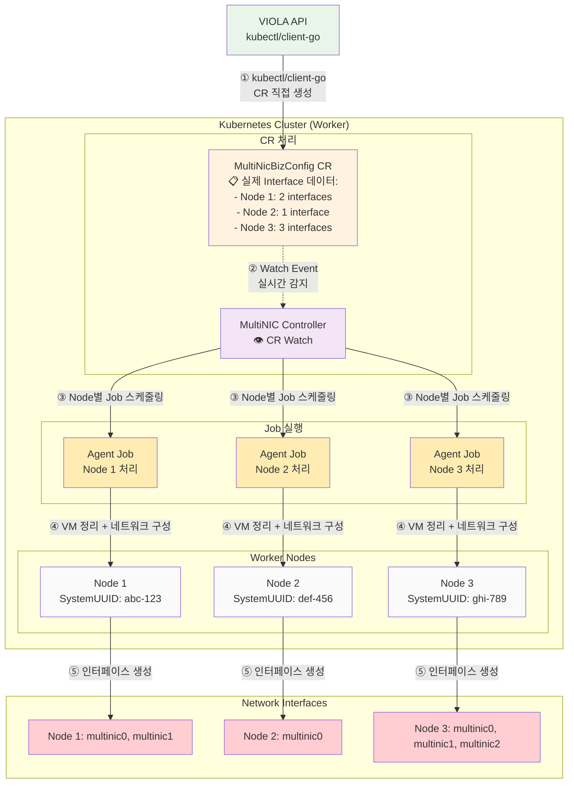
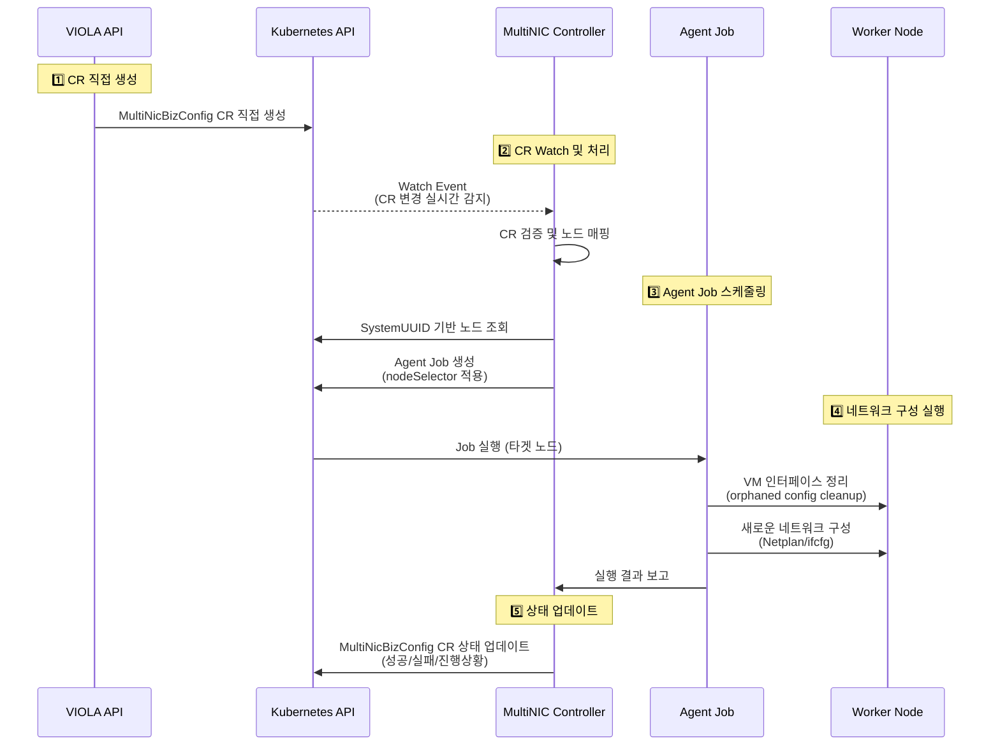
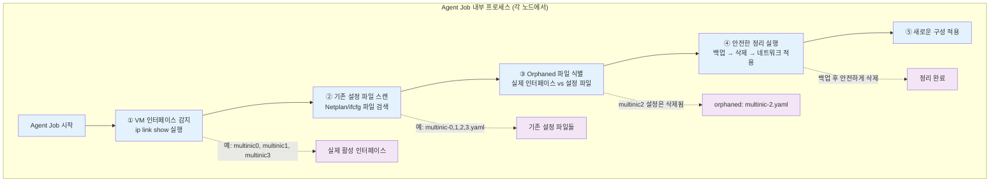
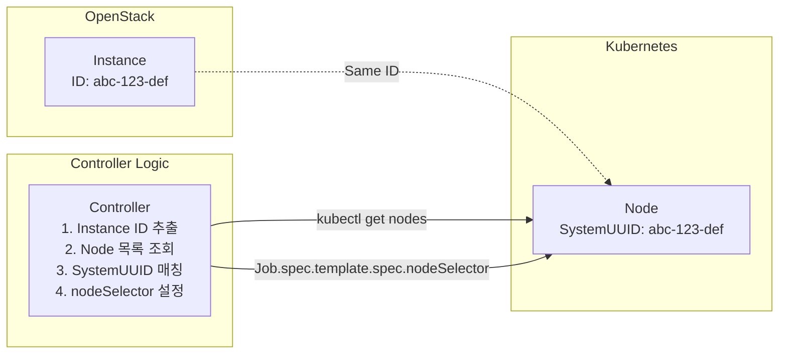

# MultiNIC Agent

> **Kubernetes 클러스터 네트워크 인터페이스 완전 자동화 에이전트**

OpenStack 환경에서 다중 네트워크 인터페이스의 **전체 생명주기**를 자동으로 관리하는 현대적인 Kubernetes Controller + Job 기반 에이전트입니다.

## 주요 기능

### 핵심 기능
- **클러스터 CRD 기반 통합**: 외부 Operator가 생성한 MultiNicBizConfig CRD를 실시간 감지 및 처리
- **지능적 노드 타겟팅**: OpenStack Instance ID와 Kubernetes Node SystemUUID 매핑으로 정확한 노드 선택
- **Job 기반 실행**: 필요시에만 실행되는 효율적인 네트워크 구성 작업
- **VM 레벨 인터페이스 정리**: OpenStack 인터페이스 삭제 시 VM의 orphaned 설정 파일 자동 정리
- **안전한 설정 적용**: 설정 실패 시 이전 상태로 자동 복구, 백업 및 롤백 지원
- **다중 OS 지원**: Ubuntu(Netplan) 및 RHEL/CentOS(ifcfg) 지원
- **Kubernetes Native**: CRD 및 Watch API를 사용한 완전한 Kubernetes 통합

## 요구사항

### 시스템 요구사항
- Kubernetes 1.20+
- Ubuntu 18.04+ 또는 RHEL/CentOS 7+
- OpenStack 환경 (Instance ID ↔ Node SystemUUID 매핑)


### 개발 요구사항
- Go 1.24+
- Docker 또는 nerdctl
- Helm 3+
- kubectl

## 아키텍처

### MultiNIC Agent 아키텍처 (Agent 관점)



### 🏗️ 멀티 클러스터 아키텍처의 핵심 구성 요소

#### 관리 클러스터 (Management Cluster)
| 컴포넌트 | 역할 | 기능 |
|----------|------|------|
| **MultiNIC Operator** | OpenStack 모니터링 | • OpenStack API 연동<br/>• 인프라 변경 감지<br/>• NIC 정보 수집 |
| **Database** | 정보 저장소 | • NIC 구성 정보 저장<br/>• 노드 매핑 정보 관리<br/>• 상태 히스토리 보관 |
| **VIOLA API** | CR 생성 |• MultiNicBizConfig CR 직접 생성|

#### 비즈 클러스터 (biz Cluster)
| 컴포넌트 | 역할 | 기능 |
|----------|------|------|
| **MultiNIC Agent Controller** | CRD 처리 | • CRD Watch 이벤트 처리<br/>• Agent Job 스케줄링<br/>• 노드 매핑 및 검증 |
| **Agent Jobs** | 네트워크 구성 | • VM 인터페이스 정리<br/>• 네트워크 설정 적용<br/>• 상태 보고 |

### 🔄 아키텍처 장점

**멀티 클러스터 분리의 이점:**
- ✅ **관리 분리**: 인프라 모니터링과 실행 환경 분리
- ✅ **확장성**: 여러 비즈 클러스터를 하나의 관리 클러스터로 관리
- ✅ **보안**: 관리 클러스터와 비즈 클러스터 간 최소 권한 통신
- ✅ **안정성**: 관리 클러스터 장애가 비 클러스터 운영에 직접적 영향 최소화

**클러스터 단위 CRD의 이점:**
- ✅ **효율성**: 노드 수에 관계없이 CRD 1개로 관리
- ✅ **일관성**: 전체 클러스터 네트워크 구성의 통합 관리
- ✅ **성능**: Watch 이벤트 수 대폭 감소
- ✅ **단순성**: 복잡한 노드별 CRD 관리 불필요

## 빠른 시작

### 1. 자동 배포 스크립트 사용 (권장)

```bash
# 개발 환경 배포
./scripts/build-and-deploy.sh --type dev

# 스테이징 환경 배포
./scripts/build-and-deploy.sh --type staging

# 프로덕션 환경 배포
./scripts/build-and-deploy.sh --type production
```

### 2. 수동 Helm 배포

```bash
# 기본 배포
helm install multinic-agent deployments/helm/ \
  --namespace multinic-system \
  --create-namespace

# 환경별 설정 파일 사용
helm install multinic-agent deployments/helm/ \
  --namespace multinic-system \
  --values deployments/helm/values-production.yaml

# 커스텀 설정
helm install multinic-agent deployments/helm/ \
  --namespace multinic-system \
  --set controller.image.tag=v1.0.0 \
  --set controller.replicas=2
```

### 3. 상태 확인

```bash
# Controller 상태
kubectl get deployment -n multinic-system multinic-agent-controller

# Pod 상태
kubectl get pods -n multinic-system -l app.kubernetes.io/component=controller

# 클러스터 CRD 상태
kubectl get multinicclusterconfigs -A

# 실행 중인 Agent Jobs
kubectl get jobs -n multinic-system -l app.kubernetes.io/name=multinic-agent

# 로그 확인
kubectl logs -n multinic-system -l app.kubernetes.io/component=controller -f
```

## 작동 원리

### 전체 워크플로우 (Agent 관점)



### 🔄 실시간 이벤트 처리

MultiNIC Agent는 Kubernetes의 **Watch API**를 사용하여 실시간으로 CRD 변경사항을 처리합니다:

- **폴링 없음**: 파일 시스템 폴링이나 데이터베이스 조회 불필요
- **즉시 반응**: CRD 생성/수정 시 즉시 이벤트 수신
- **리소스 효율**: 변경이 있을 때만 작업 수행
- **장애 복구**: Watch 연결 끊김 시 자동 재연결

### 🧹 VM 레벨 인터페이스 정리 시스템 (Session 7 구현)

각 Agent Job은 네트워크 구성 전에 **VM에서 직접 인터페이스 상태를 감지**하여 orphaned 설정을 자동으로 정리합니다:



**핵심 이점:**
- ✅ **OpenStack 인터페이스 삭제 시 VM 자동 동기화**
- ✅ **수동 설정 파일 정리 작업 불필요**
- ✅ **orphaned 설정으로 인한 네트워크 오류 방지**
- ✅ **백업을 통한 안전한 롤백 메커니즘**

### 노드 타겟팅 메커니즘

에이전트는 OpenStack Instance ID를 사용하여 정확한 Kubernetes 노드를 찾습니다:



## 설정 예시

### 테스트용 MultiNicBizConfig CRD

프로젝트에 포함된 클러스터 단위 테스트 CRD 샘플:

```bash
# 개발 환경용 클러스터 CRD 적용
kubectl apply -f test/sample-multinicclusterconfig-dev.yaml

# 프로덕션용 클러스터 CRD 적용  
kubectl apply -f test/sample-multinicclusterconfig.yaml
```

### 📋 CRD와 CR 구분 (개발팀 인수인계용)

#### CRD (Custom Resource Definition) - 스키마 정의

**CRD는 데이터 구조를 정의하는 템플릿**(class definition과 유사):

```yaml
# deployments/crds/multinicconfig-crd.yaml
apiVersion: apiextensions.k8s.io/v1
kind: CustomResourceDefinition
metadata:
  name: multinicbizconfigs.multinic.io
spec:
  group: multinic.io
  versions:
  - name: v1
    served: true
    storage: true
    schema:
      openAPIV3Schema:
        type: object
        properties:
          spec:
            type: object
            properties:
              providerId:
                type: string
                description: "Target provider id"
              specHash:
                type: string
                description: "Configuration hash for change detection"
              nodeConfigs:
                type: array
                items:
                  type: object
                  properties:
                    attachedNodeId:
                      type: string
                      description: "OpenStack Instance ID (= Node SystemUUID)"
                    attachedNodeName:
                      type: string
                    interfaces:
                      type: array
                      items:
                        type: object
                        properties:
                          portId:
                            type: string
                          macAddress:
                            type: string
                            pattern: "^([0-9A-Fa-f]{2}[:]){5}([0-9A-Fa-f]{2})$"
                          address:
                            type: string
                          cidr:
                            type: string
                          mtu:
                            type: integer
                            minimum: 68
                            maximum: 9000
  scope: Namespaced
  names:
    plural: multinicbizconfigs
    singular: multinicbizconfig
    kind: MultiNicBizConfig
```

#### CR (Custom Resource) - 실제 데이터 인스턴스

**CR은 CRD 스키마에 따라 생성되는 실제 데이터**(class instance와 유사):

```yaml
# VIOLA API가 생성하는 실제 CR 예시
apiVersion: multinic.okestro.io/v1
kind: MultiNicBizConfig
metadata:
  name: production-cluster-network
  namespace: multinic-system
  labels:
    environment: production
    cluster: production-k8s
spec:
  providerId: "0c497169-a104-4448-afde-f27b79fca904"
  specHash: "a1b2c3d4e5f6789a"
  nodeConfigs:
  - attachedNodeId: "i-0123456789abcdef0"  # Worker Node 1
    attachedNodeName: "k8s-worker-01"
    interfaces:
    - portId: "port-001-worker-01"
      macAddress: "02:00:00:00:01:01"
      address: "192.168.100.10"
      cidr: "192.168.100.10/24"
      mtu: 1500
    - portId: "port-002-worker-01"
      macAddress: "02:00:00:00:01:02"
      address: "192.168.200.10"
      cidr: "192.168.200.10/24"
      mtu: 1500

  - attachedNodeId: "i-0fedcba987654321a"  # Worker Node 2
    attachedNodeName: "k8s-worker-02"
    interfaces:
    - portId: "port-001-worker-02"
      macAddress: "02:00:00:00:02:01"
      address: "192.168.100.11"
      cidr: "192.168.100.11/24"
      mtu: 1500

  - attachedNodeId: "i-0abcdef123456789b"  # Worker Node 3
    attachedNodeName: "k8s-worker-03"
    interfaces:
    - portId: "port-001-worker-03"
      macAddress: "02:00:00:00:03:01"
      address: "192.168.100.12"
      cidr: "192.168.100.12/24"
      mtu: 1500

status:
  observedGeneration: 1
  observedSpecHash: "a1b2c3d4e5f6789a"
  conditions:
  - type: "InProgress"
    status: "True"
    lastTransitionTime: "2025-01-21T10:30:00Z"
    reason: "ProcessingNodes"
    message: "Processing network configurations for 3 nodes"
  nodeStatuses:
  - attachedNodeId: "i-0123456789abcdef0"
    attachedNodeName: "k8s-worker-01"
    state: "Configured"
    lastProcessed: "2025-01-21T10:32:15Z"
    lastJobName: "multinic-agent-i-0123456789abcdef0-20250121103200"
  - attachedNodeId: "i-0fedcba987654321a"
    attachedNodeName: "k8s-worker-02"
    state: "InProgress"
    lastProcessed: "2025-01-21T10:33:00Z"
  - attachedNodeId: "i-0abcdef123456789b"
    attachedNodeName: "k8s-worker-03"
    state: "Pending"
  summary:
    totalNodes: 3
    configuredNodes: 1
    failedNodes: 0
    pendingNodes: 2
```

## 모니터링

### Controller 헬스체크

```bash
# Controller 헬스체크
kubectl port-forward -n multinic-system deployment/multinic-agent-controller 8080:8080
curl http://localhost:8080/healthz

# 응답 예시
{
  "status": "healthy",
  "uptime": "2h15m30s",
  "processed_configs": 25,
  "active_jobs": 3,
  "crd_watcher_status": "running",
  "last_crd_processed": "2025-01-21T10:30:45Z"
}
```

### 로그 모니터링

Controller와 Agent Job 로그 확인:

```bash
# Controller 로그
kubectl logs -n multinic-system -l app.kubernetes.io/component=controller -f

# Agent Job 로그
kubectl logs -n multinic-system -l app.kubernetes.io/name=multinic-agent,job-name=multinic-agent-<node-id>-<timestamp>

# 특정 노드의 최신 Job 로그
kubectl logs -n multinic-system $(kubectl get jobs -n multinic-system -l instance=<node-id> --sort-by=.metadata.creationTimestamp -o name | tail -1) -f
```

### CRD 상태 확인

```bash
# 모든 MultiNicBizConfig 조회
kubectl get multinicclusterconfigs -A -o wide

# 특정 클러스터 설정의 상세 정보
kubectl describe multinicclusterconfig -n multinic-system <config-name>

# 클러스터 설정 상태만 확인
kubectl get multinicclusterconfigs -A -o custom-columns=NAME:.metadata.name,NAMESPACE:.metadata.namespace,APPLIED:.status.conditions[?(@.type=='Applied')].status
```

## 개발

### 프로젝트 구조

```
multinic-agent/
├── cmd/
│   ├── agent/          # Agent Job 바이너리 (apply/cleanup 모드)
│   └── controller/     # Controller 바이너리 (CRD watch)
├── internal/           # 클린 아키텍처
│   ├── domain/         # 비즈니스 로직 및 엔티티
│   ├── application/    # 유스케이스 (Controller/Agent)
│   └── infrastructure/ # 외부 시스템 연동
│       ├── k8s/       # Kubernetes API (Job/CRD 관리)
│       └── network/   # 네트워크 구성 (Netplan/ifcfg)
├── deployments/        # 배포 설정
│   └── helm/          # Helm 차트 (다중 환경 지원)
│       ├── values-dev.yaml
│       ├── values-production.yaml
│       └── templates/
├── .github/workflows/  # CI/CD 파이프라인
├── scripts/           # 배포 자동화 스크립트
└── test/             # 테스트 CRD 샘플
```

### 테스트 실행

```bash
# 전체 테스트
go test ./...

# 패키지별 테스트
go test ./internal/application/usecases -v
go test ./internal/infrastructure/k8s -v
go test ./internal/infrastructure/network -v

# 커버리지 확인
go test ./... -coverprofile=coverage.out
go tool cover -html=coverage.out
```

### 빌드

```bash
# Controller 빌드
go build -o bin/multinic-controller ./cmd/controller

# Agent 빌드
go build -o bin/multinic-agent ./cmd/agent

# Docker 이미지 빌드
docker build -t multinic-controller:latest -f Dockerfile.controller .
docker build -t multinic-agent:latest -f Dockerfile.agent .
```

## OS별 지원 세부사항

### Ubuntu (Netplan 방식)
- **설정 파일 위치**: `/etc/netplan/9X-multinicX.yaml`
- **설정 적용**: `netplan apply` 명령 사용
- **인터페이스 이름 변경**: 가능 (set-name 속성 사용)
- **지원 버전**: Ubuntu 18.04+

**생성되는 설정 파일 예시**:
```yaml
network:
  version: 2
  ethernets:
    multinic0:
      match:
        macaddress: "fa:16:3e:5e:62:3e"
      set-name: multinic0
      addresses: ["192.168.1.100/24"]
      mtu: 1500
```

### RHEL/CentOS (ifcfg 방식)
- **설정 파일 위치**: `/etc/sysconfig/network-scripts/ifcfg-multinicX`
- **설정 적용**: `systemctl restart NetworkManager` 사용
- **인터페이스 이름 변경**: `ip link set` 명령으로 직접 변경
- **지원 버전**: RHEL/CentOS 7+, Rocky Linux, AlmaLinux

**생성되는 설정 파일 예시**:
```bash
DEVICE=multinic0
NAME=multinic0
TYPE=Ethernet
ONBOOT=yes
BOOTPROTO=none
IPADDR=192.168.1.100
PREFIX=24
MTU=1500
HWADDR=fa:16:3e:5e:62:3e
```

## 문제 해결

### Controller가 시작되지 않을 때

```bash
# Pod 상태 확인
kubectl describe pod -n multinic-system -l app.kubernetes.io/component=controller

# RBAC 권한 확인
kubectl auth can-i get nodes --as=system:serviceaccount:multinic-system:multinic-agent
kubectl auth can-i create jobs --as=system:serviceaccount:multinic-system:multinic-agent
kubectl auth can-i watch multinicclusterconfigs --as=system:serviceaccount:multinic-system:multinic-agent

# MultiNicBizConfig CRD 처리 상태 확인
kubectl get multinicclusterconfigs -A -o custom-columns=NAME:.metadata.name,STATUS:.status.conditions[?(@.type=='Applied')].status
```

### Agent Job이 실행되지 않을 때

```bash
# Job 상태 확인
kubectl get jobs -n multinic-system -l app.kubernetes.io/name=multinic-agent

# Job 이벤트 확인
kubectl describe job -n multinic-system <job-name>

# 노드 선택 문제 확인
kubectl get nodes -o custom-columns=NAME:.metadata.name,SYSTEM_UUID:.status.nodeInfo.systemUUID
```

### 인터페이스가 생성되지 않을 때

1. **Instance ID 매핑 확인**: OpenStack Instance ID와 Node SystemUUID 일치 여부
2. **MAC 주소 형식**: `00:11:22:33:44:55` 형식인지 확인
3. **Job 로그 확인**: Agent Job의 실행 로그에서 에러 메시지 확인
4. **VM 인터페이스 정리 확인**: Agent Job의 orphaned 설정 정리 과정 확인

```bash
# 최신 Agent Job 로그 확인 (VM 정리 과정 포함)
kubectl logs -n multinic-system $(kubectl get jobs -n multinic-system -l app.kubernetes.io/name=multinic-agent --sort-by=.metadata.creationTimestamp -o name | tail -1)

# VM 인터페이스 정리 관련 로그 필터링
kubectl logs -n multinic-system <job-name> | grep -E "(DetectActiveInterfaces|CleanupOrphanedConfigs|orphaned)"

# 특정 노드의 실제 인터페이스 상태 확인
kubectl get nodes <node-name> -o jsonpath='{.status.nodeInfo.systemUUID}'
```

### VM 인터페이스 정리 문제 해결

**Orphaned 설정 파일이 정리되지 않을 때:**

```bash
# Agent Job에서 VM 인터페이스 감지 로그 확인
kubectl logs <agent-job> | grep "DetectActiveInterfaces"

# 백업 파일 확인 (Ubuntu)
kubectl exec <agent-pod> -- ls -la /etc/netplan/backup/

# 백업 파일 확인 (RHEL/CentOS) 
kubectl exec <agent-pod> -- ls -la /etc/sysconfig/network-scripts/backup/

# 수동으로 VM 인터페이스 확인 
kubectl exec <agent-pod> -- ip link show | grep multinic
```

## 보안 고려사항

- **Controller 보안**: 비권한 컨테이너로 실행, readOnlyRootFilesystem 적용
- **Agent Job 보안**: 네트워크 구성을 위해 필요한 최소 권한만 부여 (NET_ADMIN, SYS_ADMIN)
- **RBAC**: Kubernetes 리소스에 대한 최소 권한 원칙 적용
- **CRD 접근**: MultiNicBizConfig CRD에 대한 watch/update 권한만 부여
- **VM 정리 보안**: 백업 생성으로 안전한 설정 파일 정리, 롤백 가능
- **SystemUUID 매핑**: Kubernetes Node API 사용으로 보안 강화


### 기존 DaemonSet 대비 개선사항

| 항목 | 기존 DaemonSet | 새로운 Controller + Job |
|------|----------------|-------------------------|
| 리소스 사용 | 모든 노드에서 상시 실행 | 필요시에만 Job 실행 |
| 보안 | 모든 노드에서 privileged | Controller는 비권한, Job만 권한 |
| 확장성 | 노드 수에 비례한 리소스 | 단일 Controller + 필요시 Job |
| 장애 복구 | DaemonSet 재시작 | Job 기반 자동 재시도 |
| 통합 방식 | 데이터베이스 폴링 | CRD 기반 실시간 Watch |
| 노드 타겟팅 | 모든 노드에서 필터링 | 정확한 노드에만 Job 실행 |


## 📋 요약

MultiNIC Agent는 **CRD 기반의 현대적인 Kubernetes 네이티브 아키텍처**로 설계되어:

- ✅ **External Operator**가 OpenStack 모니터링 후 **MultiNicBizConfig CRD**를 Kubernetes API로 직접 생성
- ✅ **Controller**가 CRD 변경사항을 실시간 Watch하여 즉시 반응
- ✅ **Agent Job**이 SystemUUID 매핑을 통해 정확한 노드에서만 실행
- ✅ **보안 강화**된 비권한 Controller와 최소 권한 Agent
- ✅ **리소스 효율적**인 필요시에만 실행되는 Job 기반 처리

이 아키텍처는 기존 파일 기반이나 DaemonSet 방식 대비 **보안성**, **효율성**, **Kubernetes 네이티브 통합**에서 현저한 이점을 제공합니다.
